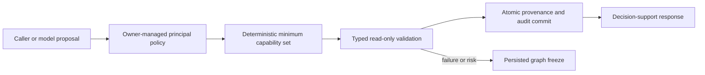

# Architecture and authority

The diagram describes the Rust validation harness used by the native COBOL gate through `SD_BROKER`. The broker enforces licensing, principal authorization, deterministic sparse routing, typed validation, graph state and atomic evidence/audit writes. COBOL checks request and result contracts around one `EXECUTE-AND-COMMIT` call. The gate halts without the linked broker. The implemented native target is Linux GnuCOBOL with SDABI001; see [ABI and deployment details](cobol-broker.md). Trusted ingestion and additional foreign adapter dispatch remain future work.

Project-owned execution uses COBOL, Rust and Prolog. REXX is the sole script glue and accepts fixed actions only. Codex is launched as a native executable; the Qwen adapter and launcher contain no JavaScript runtime dependency. Rails and Haskell files remain optional integration/design sources from the original language family.

An embedded `david-execution-gate` verifies issuer-signed payment-backed entitlements, AES-256-GCM authentication, deployment identity and validity before protected execution. License authorization remains separate from principal permissions and banking authority. The shipped signing root is empty and fails closed. See [execution entitlements](execution-entitlements.md) for provisioning and anti-clone limits.

Only four read-only adapters exist. There is no shell execution, HTTP endpoint dispatch, GPU embedding requirement, bank credentials, or LLM dependency. Future vector/model candidates are hints intersected with trusted capabilities and grants. The registry is immutable in-process; unknown agents are rejected, not dropped.

Audit events chain over canonical event bytes including previous hash. They bind provenance content by hash. SQL triggers prevent application-level updates/deletes. Transaction rollback prevents evidence without audit. Startup and each request verify the stored chain, and restart continues from its head.

This local store is tamper-evident within its stated threat model, not immutable storage against a machine owner. An administrator can replace the database, remove triggers, or truncate the tail; detecting tail deletion requires an independently trusted signed anchor. Graph and principal integrity also require authenticated administrative storage in production. Raw secrets and unknown sensitive text cannot be exhaustively identified by field/string checks; ingestion must exclude secrets before reaching this boundary. No production security certification is claimed.

Human migration authority is never synthesized by these adapters. Payment execution remains absent even when validation succeeds. Human review packages and authenticated authority records are future work; freezes currently require offline investigation rather than an automated resume.
