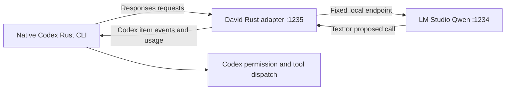

# Codex Rust harness with local Qwen

The upstream open-source Codex repository is pinned as the `vendor/codex` Git submodule at `95ec468619386ebb93506ac2091a48e5a558d25c`. It retains upstream Apache-2.0 LICENSE and NOTICE. Source metadata is in `vendor/codex-source.json`. The upstream checkout is unchanged.

`rust/qwen-endpoint` is the new Rust Responses protocol adapter. The installed native Rust Codex CLI (0.159.3 on this machine) connects through its custom provider configuration. The adapter was compiled locally; the entire upstream Codex workspace was not rebuilt. Source revision and installed CLI version are recorded separately.



## Start

The David launcher now requires `codex.launch`, and each adapter inference requires `qwen.responses` in a paid execution entitlement. Provision the pinned signing authority and deployment grant as described in [execution entitlements](execution-entitlements.md) before running the commands below. A fresh checkout denies inference. `/health` reports the current licensing state without calling the model. These gates apply to the David integration; they do not modify the upstream native Codex program or LM Studio.

LM Studio must serve `qwen-local` with 16,384-token context at `127.0.0.1:1234`. No OpenAI API key is needed. If local server authentication is enabled, supply `LM_STUDIO_API_KEY` through the process environment.

On this Windows machine, Rust and GNU compiler tools are installed under ignored `.tools/`. System PATH and IDE configuration were not changed.

```powershell
& .tools/regina/rexx.exe rexx/david.rexx build
& .tools/regina/rexx.exe rexx/david.rexx test
& .tools/regina/rexx.exe rexx/david.rexx qwen-start
& .tools/regina/rexx.exe rexx/david.rexx qwen-verify
& .\rust\target\debug\david.exe codex "Reply with exactly OK. Do not call tools. /no_think"
```

Without a prompt, `david codex` opens the interactive CLI. The Rust launcher finds the native executable in the installed DataGrip Codex package, or uses a native binary selected by `CODEX_CLI_BIN`. It never invokes the package's JavaScript wrapper. Each child uses `.codex-local`, the local model catalog and compact Qwen instructions. It does not overwrite the user's Codex home, credentials, hooks or active IDE session. Defaults are read-only/on-request, shell tools disabled, web search disabled. This coding harness grants no corporate banking permissions and does not yet expose the corporate validators as Codex tools.

For another machine, install Rust with its platform linker, then:

```text
git submodule update --init vendor/codex
cargo test --manifest-path rust/Cargo.toml --locked
cargo build --manifest-path rust/Cargo.toml --locked
rust/target/debug/david qwen-start
```

The local adapter toolchain is Rust 1.99.0. The upstream source workspace separately requests Rust 1.95.0. `rexx/david.rexx` resolves this machine's local GNU linker and assembler. w64devkit 2.10.0 supplies the assembler; its archive SHA-256 is `18d0a4c71a166f8401ab6305781bec5882b40b5e06ba9807c61cb5f3b3c6325e`. Regina 3.9.6 is installed under `.tools/regina` from the [official release archive](https://sourceforge.net/projects/regina-rexx/files/regina-rexx/3.9.6/). Compiler downloads and build artifacts are ignored. The REXX launcher accepts one fixed action; file paths and prompts are passed directly to the native CLI.

## Rust structure and wire mapping

| Upstream Codex source | Local integration |
| --- | --- |
| `codex-rs/model-provider-info/src/lib.rs`: ModelProviderInfo/WireApi | `config/codex-qwen.toml` defines Responses provider at :1235 |
| `codex-rs/tools/src/responses_api.rs`: namespaces/functions/custom tools | `prepare` flattens namespaces and wraps custom input in a typed string field |
| `codex-rs/protocol/src/models.rs`: ResponseItem | `restore` and `restore_namespaces` recover native function/custom identities |
| `codex-rs/codex-api/src/sse/responses.rs`: item event consumer | `sse` emits ordered response/item/text/tool/completed events with actual usage |
| `codex-rs/protocol/src/openai_models.rs`: ModelInfo | `config/qwen-models.json` supplies local context and tool metadata |

LM Studio accepts string `tool_choice` values but rejects named-choice objects. The adapter restricts declarations to the chosen tool, then uses `required`. Namespace names map to `namespace__name` and are restored on return. Custom arguments must contain exactly one string field, `input`. Malformed output fails closed. Qwen does not enforce custom grammar during sampling; receiving Codex tools still validate their inputs.

## Supported subset and limits

* Fixed loopback bind/upstream URL and model alias. HTTP proxies and redirects disabled; browser-origin requests rejected.
* Stateless text messages, function/custom tools, string tool-result continuation, JSON replies and buffered Responses SSE. The adapter executes no tools.
* Inference completes before SSE is emitted. This is buffered event delivery, not real-time token streaming. Output text, item IDs and usage come from the actual model response.
* Requests: 512 KiB. Replies: 2 MiB. Output: at most 512 tokens, default 256. Inference deadline: 90 seconds. Requests are served serially.
* Images, hosted search, reasoning input items, remote compaction, previous-response state, background work, compressed requests and unknown tool types are rejected. Unsupported encrypted reasoning request metadata is omitted.
* `/health` checks the adapter process, not model readiness. `qwen:verify` performs real inference and wire checks.
* The 0.6B model smoke test establishes interoperability, not banking reasoning or coding quality. Models remain proposal-only relative to the corporate runtime.

Official configuration documentation: [Codex configuration reference](https://developers.openai.com/codex/config-reference). Implementation was also checked against the pinned source and installed CLI, which have different release revisions.
